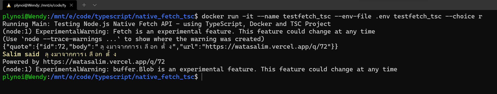

# Testing Node.js Native Fetch API - using TypeScript, Docker and TSC
- version: 1.0
- Last update: Apr 2022
- Environment: Windows WSL
- Prerequisite: [Docker and Internet connection](#prerequisite)

## <a id="intro"></a>Introduction

The Node.js **native** [Fetch API](https://developer.mozilla.org/en-US/docs/Web/API/Fetch_API) is now available as experimental feature in [Node v17.5](https://nodejs.org/en/blog/release/v17.5.0/). Developers do not need to install extra fetch packages anymore. Frontend Developers will be familiar with the HTTP code in Node. 

To test this built-in API, you can run the native Fetch code with the ```--experimental-fetch``` when you run the Node application as follow:

```
$> node --experimental-fetch app.js
```

Since it is still an experimental feature, so it is advisable to test it in a controlled environment such as Docker. This helps to avoid mess-up your local environment. 

## <a id="demo"></a>Demo Project

This demo project is a simple console application that requests an anonymous Far-right quote message from [@narze](https://twitter.com/narze)'s [Awesome Salim Quotes](https://watasalim.vercel.app/) application and API using the Node v17.50's native Fetch API. The application is written in [TypeScript](https://www.typescriptlang.org/), then compile  to Node.js compatible JavaScript with the [Typescript TSC](https://www.typescriptlang.org/docs/handbook/compiler-options.html). 

 

If you want to see the same project with the [Webpack](https://webpack.js.org/), please visit my [typescript-learning-fetch-webpack](https://github.com/plynoi/typescript-learning-fetch-webpack) repository.

**Note**: This is just my simple project for learning TypeScript and its ecosystem.

## <a id="dev_detail"></a>Development Detail

According to this [Stack Overflow post](https://stackoverflow.com/questions/70309135/chalk-error-err-require-esm-require-of-es-module), the version 5 of the [chalk library](https://www.npmjs.com/package/chalk) has changed to [ESM](https://gist.github.com/sindresorhus/a39789f98801d908bbc7ff3ecc99d99c) and somehow it breaks TypeScript 😫😫😫. The workaround is using Chalk 4 instead.

## <a id="single_vs_multi"></a>Single-Stage Build vs Multi-Stage Builds

## <a id="prerequisite"></a>Prerequisite
This demo project requires the following dependencies software.
1. Docker.
2. Internet connection.

## <a id="running"></a>Running the application.

The first step is to unzip or download the example project folder into a directory of your choice, then set up the project ```.env``` file based on your preference.

1. Start Docker
2. create a file name ```.env``` with the following content.
    ```
    BASE_URL=https://watasalim.vercel.app
    # Random API
    RANDOM_API_ENDPOINT=/api/quotes/random

    # Latest API
    LASTEST__API_ENDPOINT=/api/quotes/latest
    ```
3. Build a Docker image with the following command:
    ```
    $> docker build . -t testfetch_tsc
    ```
4. Run a Docker container with the following command: 
    ```
    $> docker run -it --name testfetch_tsc --env-file .env testfetch_tsc --choice <l || r>
    ```
5. To stop and delete a Docker container, run the following command:
    ```
    $> docker stop testfetch_tsc
    $> docker rm testfetch_tsc
    ```

## <a id="references"></a>References
For further details, please check out the following resources:
* [The Fetch API is finally coming to Node.js](https://blog.logrocket.com/fetch-api-node-js/) blog post.
* [chalk - Error [ERR_REQUIRE_ESM]: require() of ES Module](https://stackoverflow.com/questions/70309135/chalk-error-err-require-esm-require-of-es-module) Stack Overflow post.
* [Typescript TSC](https://www.typescriptlang.org/docs/handbook/compiler-options.html) page.
* [TypeScript Handbook](https://www.typescriptlang.org/docs/handbook/intro.html) page.